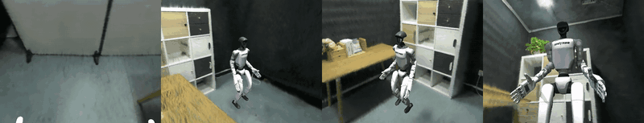
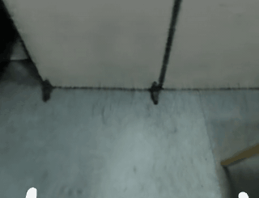
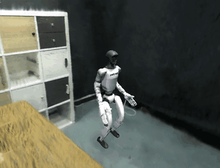
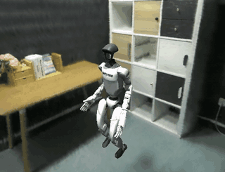
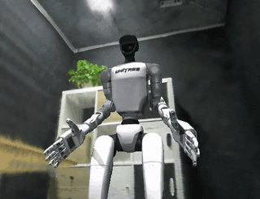

# MuGS: MuJoCo + 3D Gaussian Splatting for Photorealistic Robot Simulation

**MuGS** is a hybrid rendering pipeline that combines MuJoCo physics simulation with 3D Gaussian Splatting (3DGS) photorealistic backgrounds to create photo-realistic robot simulation environments for Vision-Language-Action (VLA) model training and evaluation.

## Demo — DISCOVERSE 3DGS rooms × AndroidTwin multi-cam rollout

Four cameras, one rollout, one shared `world_T_gs` rigid alignment. The
G1 + Inspire FTP stands via AMO inside the DISCOVERSE `lab3` 3DGS room;
each frame is captured from the robot's first-person `head_cam` plus
three world cams (front-diagonal, over-the-shoulder, low side hero).
The composite below stitches all four panes — every panel is a hybrid
MuGS render (3DGS bg + MuJoCo fg, alpha-blended per camera).



| Camera | View |
|---|---|
| `robot/head_cam` (first-person, D435 mount, 47° down, 42° vfov) |  |
| `world_cam` (front-diagonal) |  |
| `world_back_cam` (over-the-shoulder back) |  |
| `world_side_cam` (low hero shot) |  |

Two pieces of plumbing make this work compared to the kitchen demo
below:

- **One alignment for all cams.** `MuGSRecorder` accepts a `world_T_gs`
  4×4 transform that maps MJ-world → GS-world. Every simultaneous camera
  applies the same transform to its live MJ pose, so the four views see
  the same room from coherent perspectives without per-cam initial-pose
  snapping.
- **OpenGL → OpenCV Y-flip.** gsplat is OpenCV (+Y down). MuGS internally
  negates column 2 of the cam rotation (Z forward), so the recorder
  pre-negates column 1 in the `world_T_gs` branch. Without this, every
  level-horizon world cam renders upside-down; the first-person head cam
  survives unflipped only because its 47° pitch coincidentally lines up.

Get the scene:

```bash
bash scripts/data_collection/download_discoverse_scenes.sh   # default: lab3
```

Render the demo (from the AndroidTwin repo, scene path adjusted):

```bash
.venv/bin/python examples/discoverse_room_rollout.py \
  --bg-ply /path/to/MuGS/assets/scenes/discoverse_unpacked/lab3/point_cloud.ply \
  --out-dir outputs/discoverse_lab3 \
  --num-steps 120 --width 480 --height 360 \
  --gs-fx 380 --gs-fy 380 --yaw-deg 180
```

See [`docs/discoverse_scenes.md`](docs/discoverse_scenes.md) for the
scene catalog, alignment knobs (`yaw_deg`, GS focal, floor 5%-percentile,
bbox-center vs median), and the training-cam convex-hull caveat that
makes some camera placements render dim/noisy.

## What is MuGS?

MuGS enables **photorealistic robot simulation** by compositing physically accurate MuJoCo robot renders with real-world 3DGS backgrounds at **5000+ FPS**. It bridges the Sim2Real gap for vision-based robot learning by providing training data that looks like real photos while maintaining perfect physics simulation.

**Key Innovation**: Two-stage rendering pipeline
- **Stage 1**: MuJoCo renders robot/objects (CPU-based, fast)
- **Stage 2**: 3DGS renders background (GPU-based, photorealistic)
- **Compositing**: Alpha-blending with automatic segmentation masks


### AndroidTwin × MuGS — G1 humanoid in INRIA kitchen

Hybrid render demo from the **AndroidTwin** humanoid bench
(Unitree G1 + Inspire FTP 5-finger hands, 53 dof) composited on the
INRIA mip-NeRF 360 *kitchen* 3DGS scene.
Task: `p1_amo_table_grasp` (4 GraspNet objects on a table, AMO
whole-body controller, head_cam first-person view), zero-policy
30-step rollout.

#### Pipeline — body-prefix masking


`scene_inspire.xml` leaves geoms unnamed, so the recorder resolves
foreground pixels by **body name prefix** instead of geom name.
SceneCfg attaches each entity with a namespace prefix (`robot/`,
`table/`, `obj_NNN/`, `grasp_cube/`…); any geom whose parent body
matches one of the configured prefixes joins the fg mask.

| panel | what |
|-------|------|
| 1. MuJoCo foreground | `mujoco.Renderer.render()` at `robot/head_cam` |
| 2. Geom segmentation | `enable_segmentation_rendering()` raw geom-id channel |
| 3. FG mask | `np.isin(seg, fg_geom_ids)` → 29.3% coverage on this view |

#### Hybrid render — bg cam tracks MuJoCo head


3DGS scenes live in COLMAP world frames disjoint from MuJoCo world.
The recorder pins the **initial** GS bg pose to a training cam
(kitchen `cam[0]`) and *assumes* it coincides with the initial MuJoCo
head_cam pose; on each capture it applies the MuJoCo-frame head_cam
delta (rotated into GS frame) on top of that initial pose so the bg
tracks head motion. Intrinsics stay fixed at the kitchen training
cam's fx/fy.

```
R_align = R_gs0 · R_mj0ᵀ           # one-shot at first capture
pos_t   = pos_gs0 + R_align · (pos_mj_t − pos_mj_0)
R_t     = R_align · R_mj_t
```

#### Static vs tracked background


Same MuJoCo frame, two bg policies:

- **Left (static)** — `bg_t == bg_0` for every capture; bg-region
  pixel diff stays at 0.05/255 (just libx264 noise).
- **Right (tracked)** — bg follows head motion; bg-region pixel
  diff rises to ~90/255 by frame 5 (kitchen content shifts as expected).

#### Animation


16-frame loop @ 10 fps, 320×240 (downsampled from 31-frame mp4 at
640×480). Top of frame turns black mid-rollout because the head
pitches down enough that the bg cam looks above the kitchen ply's
trained volume — a known tradeoff of the no-scale-calibration
assumption.

#### Reproduce

```bash
uv run at-eval \
  --task p1_amo_table_grasp --policy zero \
  --num-episodes 1 --max-episode-steps 30 \
  --camera robot/head_cam \
  --render-backend mugs --mugs-mode hybrid \
  --mugs-ply  /path/to/kitchen/point_cloud.ply \
  --mugs-bg-cam-json /path/to/kitchen/cameras.json \
  --mugs-bg-cam-idx 0 \
  --eval-dir outputs/evals_mugs_hybrid
```

`MUJOCO_GL=egl` required on headless servers. The wrapper
(`MuGSRecorder`) lives at `androidtwin/envs/mugs_recorder.py` in the
AndroidTwin repo and uses MuGS's standalone `GaussianSensor` API.

## Features

### Core Rendering
- **Hybrid Rendering**: 3DGS background + MuJoCo foreground @ 5000+ FPS
- **Physics-Accurate**: Full MuJoCo physics simulation with contact dynamics
- **Photorealistic**: 3D Gaussian Splatting for realistic backgrounds from real-world scans
- **Camera Aligned**: Automatic camera parameter extraction and coordinate system conversion
- **Flexible Modes**: `hybrid`, `3dgs_only`, `mujoco_only` rendering modes

### Integration & Usability
- **Easy Integration**: Drop-in `GaussianSensor` API for standalone use
- **Batch Rendering**: mjlab integration for parallel multi-environment rendering (`mugs_mjlab.tasks`: ready-to-use env configs + benchmark runner — 4096 envs in one batched warp + gsplat call)
- **Automatic Masking**: Body-prefix or geom-name based foreground segmentation
- **Camera Tracking**: Dynamic background camera follows MuJoCo camera motion

### Post-Processing (Optional)
- **Super-Resolution**: AI upscaling (Real-ESRGAN) for photorealistic detail
  - Low-res rendering (320×240) → High-res output (1280×960)
  - 4x upscaling with photorealistic texture enhancement
  - Modular design: lazy-loaded, GPU-accelerated, batch processing support

### Asset Support
- **Pretrained Scenes**: INRIA kitchen (mip-NeRF 360 dataset)
- **External Assets**: GS-Playground scenes, DISCOVERSE tasks (via download scripts)
- **Custom Scenes**: Support for any 3DGS PLY files from COLMAP/Nerfstudio

## Quick Start

### Basic Rendering

```python
from mugs.sensors import GaussianSensor, GaussianSensorConfig

# 1. Configure sensor
config = GaussianSensorConfig(
    width=640,
    height=480,
    background_ply_path="path/to/point_cloud.ply",
    render_mode="hybrid",  # "hybrid" | "3dgs_only" | "mujoco_only"
    robot_geom_names=["link1", "link2", "gripper"],
)

sensor = GaussianSensor(config)

# 2. Render
result = sensor.render(model, data, camera_name, return_components=True)

# 3. Access components
rgb = result['rgb']              # Final hybrid image (H, W, 3) uint8
foreground = result['foreground'] # MuJoCo only
background = result['background'] # 3DGS only
mask = result['mask']            # Blending mask
```

### Batched parallel rendering (mjlab)

Run **thousands of envs in parallel** with one batched mjwarp render + one
gsplat rasterization call. `mugs_mjlab.tasks` ships a YAM lift-cube task
config with a `GaussianSensorMjlab` pre-attached to the wrist camera, plus a
generic benchmark runner that works for any `ManagerBasedRlEnvCfg` factory:

```python
from mjlab.envs import ManagerBasedRlEnv
from mugs_mjlab import (
    make_yam_lift_cube_gs_env_cfg,
    kitchen_ply_path,
    benchmark_env_cfg,
    print_benchmark_table,
)

# 1. Build a 4096-env photorealistic YAM lift-cube env.
cfg = make_yam_lift_cube_gs_env_cfg(
    ply_path=kitchen_ply_path(),  # bundled INRIA kitchen scene
    num_envs=4096,
    width=160, height=120,
    render_mode="hybrid",         # 3DGS bg + MuJoCo fg + alpha-blend
)
env = ManagerBasedRlEnv(cfg=cfg, device="cuda")
obs, _ = env.reset()
# obs['gs_rgb'].rgb.shape == (4096, 120, 160, 3)  uint8

# 2. Sweep batch sizes and print a throughput table (RTX 4090: ~12.5k env-FPS @ 4096).
results = benchmark_env_cfg(
    lambda n: make_yam_lift_cube_gs_env_cfg(kitchen_ply_path(), num_envs=n),
    env_counts=(1, 64, 1024, 4096),
)
print_benchmark_table(results)
```

`benchmark_env_cfg` accepts any `int -> ManagerBasedRlEnvCfg` factory, so the
same runner works for your own mjlab task. CLI shim:

```bash
python scripts/evaluation/benchmark_mjlab_envs.py --env-counts 1 64 1024 4096
# Override scene / resolution / mode:
python scripts/evaluation/benchmark_mjlab_envs.py \
    --ply /path/to/scene.ply --width 320 --height 240 --render-mode hybrid
```

### With Super-Resolution (Optional)

```python
from mugs.postprocess import SuperResolution, SuperResolutionConfig

# 1. Low-res rendering (fast)
sensor = GaussianSensor(GaussianSensorConfig(width=320, height=240, ...))
img_lr = sensor.render(model, data, camera_name)  # 320×240

# 2. AI upscaling (photorealistic)
sr = SuperResolution(SuperResolutionConfig(
    model_name="RealESRGAN_x4plus",
    scale=4,
))
img_hr = sr.upscale(img_lr)  # 1280×960

# Installation: pip install realesrgan basicsr
# Download model: python scripts/download_sr_models.py --model RealESRGAN_x4plus
```

## Demos

### YAM Manipulation
```bash
TORCH_CUDA_ARCH_LIST="8.6" python examples/yam_standalone_demo.py
```

### Quality Comparison
```bash
TORCH_CUDA_ARCH_LIST="8.6" python examples/quality_comparison_demo.py
```

### Wrist Camera (Task View)
```bash
TORCH_CUDA_ARCH_LIST="8.6" python examples/yam_wrist_camera_demo.py
```

### Super-Resolution Pipeline
```bash
# 1. Install SR dependencies
pip install realesrgan basicsr

# 2. Download pretrained models
python scripts/download_sr_models.py --model RealESRGAN_x4plus

# 3. Run demo
TORCH_CUDA_ARCH_LIST="8.6" python examples/sr_pipeline_demo.py
```

### Using External Assets
```bash
# List available external asset sources
python scripts/download_external_assets.py list

# Download GS-Playground assets
python scripts/download_external_assets.py gs-playground

# Download Bridge-GS dataset
python scripts/download_external_assets.py bridge-gs

# Run examples with external assets
TORCH_CUDA_ARCH_LIST="8.6" python examples/use_external_assets.py
```

See `docs/EXTERNAL_ASSETS.md` for detailed tutorial.

## Performance

### Hardware

| Component | Spec |
|---|---|
| GPU | NVIDIA GeForce RTX 4090 (24 GB, sm_89) |
| Driver / CUDA runtime | 580.126.09 / CUDA 13.0 |
| PyTorch | 2.11.0 + cu130 |
| gsplat | 1.5.3 (JIT-compiled with `TORCH_CUDA_ARCH_LIST=8.6+PTX`) |
| Build toolchain | CUDA 11.6 nvcc → driver-JIT to sm_89 |

### Single-camera / single-env throughput

| Stage | Latency | Notes |
|---|---|---|
| MuJoCo RGB | 0.21 ms | foreground render |
| Segmentation | 1.33 ms | body-prefix mask |
| Mask extract | 0.15 ms | `np.isin` |
| **3DGS GPU** | **0.12 ms** | 6.18k gaussians @ 160×120 |
| Composite | 0.13 ms | alpha-blend |
| **Total** | **1.94 ms** | **515 Hz end-to-end** |

### Parallel-env 3DGS rendering (RTX 4090, 160×120)

Each environment gets an independent camera pose (sphere of look-at views).
See `scripts/evaluation/benchmark_gsplat_parallel.py`.

| Envs | 6k gaussians | 50k gaussians | 100k gaussians | 500k gaussians |
|---:|---:|---:|---:|---:|
| 1 | 10,479 | 10,421 | 10,479 | 9,625 |
| 16 | 123,513 | 126,422 | 120,159 | 30,148 |
| 64 | 489,251 | 249,321 | 137,871 | 24,685 |
| 256 | **1,101,650** | 206,304 | 114,741 | 25,196 |
| 1024 | 883,496 | 187,414 | 109,543 | OOM |
| 2048 | 756,534 | 196,071 | 112,714 | OOM |
| 4096 | 757,980 | 188,734 | **109,481** | OOM |

(numbers = total env-FPS; per-env latency at 4096 envs is **1.32 µs** for kitchen-scale)

### 4096 envs × resolution (6k gaussians)

| Resolution | Latency | Env-FPS | Peak VRAM |
|---|---:|---:|---:|
| 80×60 | 2.60 ms | 1,575,441 | 21.0 GB |
| 160×120 | 5.30 ms | 773,220 | 3.6 GB |
| 224×224 | 11.01 ms | 372,049 | 7.4 GB |
| 320×240 | 15.84 ms | 258,643 | 10.6 GB |

### End-to-end mjlab + GaussianSensorMjlab (hybrid, 160×120, 6k gaussians)

Full pipeline: mjlab `step()` (physics + observations + reward) **plus**
`GaussianSensorMjlab` in hybrid mode (mjwarp foreground + 3DGS background +
alpha-composite). `yam_lift_cube` manipulation task with a wrist-mounted
camera. Reproduce in one command:

```bash
python scripts/evaluation/benchmark_mjlab_envs.py
```

| Envs | Step latency | Env-FPS | Peak VRAM |
|---:|---:|---:|---:|
| 1 | 4.34 ms | 231 | 0.10 GB |
| 4 | 4.44 ms | 901 | 0.21 GB |
| 16 | 5.66 ms | 2,825 | 0.21 GB |
| 64 | 9.85 ms | 6,499 | 0.21 GB |
| 256 | 25.97 ms | 9,859 | 0.21 GB |
| 1024 | 84.18 ms | 12,164 | 0.31 GB |
| 4096 | 326.32 ms | **12,552** | 0.32 GB |

### Takeaways

- Single-env 3DGS clears the **5000 FPS** project target by ~2× at any realistic scene size.
- Saturation point on a 4090: **batch ≈256 at 6k gaussians**, **batch ≈64 at 100k gaussians** (kernel becomes memory-bandwidth-bound thereafter).
- 4096 parallel envs is feasible up to ~100k gaussians (22 GB peak); 500k gaussians OOMs past ~256 envs on 24 GB.
- End-to-end mjlab + MuGS hybrid pipeline saturates at **~12.5k env-FPS** for 1024–4096 envs at 160×120 — bounded by mjlab's physics step + mjwarp segmentation render, not by 3DGS (which costs <0.4 ms per batch at this scale).
- Background loading: ~2 s, cached for subsequent renders.

## Technical Details

### Camera Alignment

MuGS automatically handles camera parameter extraction and coordinate system conversion:

1. **FOV Handling**: Respects MuJoCo's `<compiler angle="radian"/>` directive
2. **Coordinate System**: Converts MuJoCo (+Z forward) to OpenGL (-Z forward)
3. **View Matrix**: Automatic construction from camera position and rotation

See `docs/CAMERA_ALIGNMENT_FIX.md` for details.

### Rendering Pipeline

1. Extract camera parameters from MuJoCo
2. Render MuJoCo foreground (robot + objects)
3. Render 3DGS background with aligned camera
4. Alpha-composite using robot segmentation mask

## Documentation

### Getting Started
- **[`docs/OVERVIEW.md`](docs/OVERVIEW.md)** - 📘 Project overview (what MuGS does, repo structure, use cases)
- **[`docs/API_QUICKSTART.md`](docs/API_QUICKSTART.md)** - 🚀 Quick start guide (中文)
- **[`docs/API_REFERENCE.md`](docs/API_REFERENCE.md)** - 📖 Complete API reference

### Technical Guides
- **[`docs/SUPER_RESOLUTION.md`](docs/SUPER_RESOLUTION.md)** - 🎨 AI upscaling guide (Real-ESRGAN)
- **[`docs/CAMERA_ALIGNMENT_FIX.md`](docs/CAMERA_ALIGNMENT_FIX.md)** - 📐 Camera parameter handling
- **[`docs/EXTERNAL_ASSETS.md`](docs/EXTERNAL_ASSETS.md)** - 📦 Using GS-Playground, DISCOVERSE assets
- **[`docs/SHOWCASE.md`](docs/SHOWCASE.md)** - 🎬 Creating demonstration materials

### Design & Status
- **[`docs/design/PROJECT_ARCHITECTURE.md`](docs/design/PROJECT_ARCHITECTURE.md)** - 🏗️ System architecture
- **[`docs/design/TECHNICAL_DESIGN.md`](docs/design/TECHNICAL_DESIGN.md)** - 🔧 Technical design notes
- **[`docs/PROJECT_STATUS.md`](docs/PROJECT_STATUS.md)** - 📊 Current status
- **[`docs/development/TODO.md`](docs/development/TODO.md)** - 📋 Development roadmap

## Installation

```bash
# 1. Clone and install MuGS (standalone GaussianSensor API).
git clone https://github.com/Renforce-Dynamics/MuGS.git
cd MuGS && pip install -e .

# 2. (Optional) install the mjlab integration for batched multi-env rendering.
pip install -e . -f pyproject_mugs_mjlab.toml   # needs mjlab + mujoco_warp
```

For RTX 4090 + CUDA 11.x build toolchains, set
`TORCH_CUDA_ARCH_LIST="8.6+PTX"` so gsplat JIT-compiles to sm_89 via PTX.
On headless servers, `MUJOCO_GL=egl` is required.

## Requirements

- Python 3.10+
- MuJoCo 3.0+
- PyTorch 2.0+
- gsplat 1.5+
- (mjlab integration only) mjlab + mujoco_warp on CUDA 12.x runtime

## Citation

```bibtex
@article{mugs2026,
  title={MuGS: Photorealistic Simulation for Vision-Language-Action Models},
  author={},
  journal={},
  year={2026}
}
```

## License

MIT License

## Acknowledgments

- MuJoCo physics engine
- gsplat rendering library
- Kitchen scene from 3DGS benchmark
