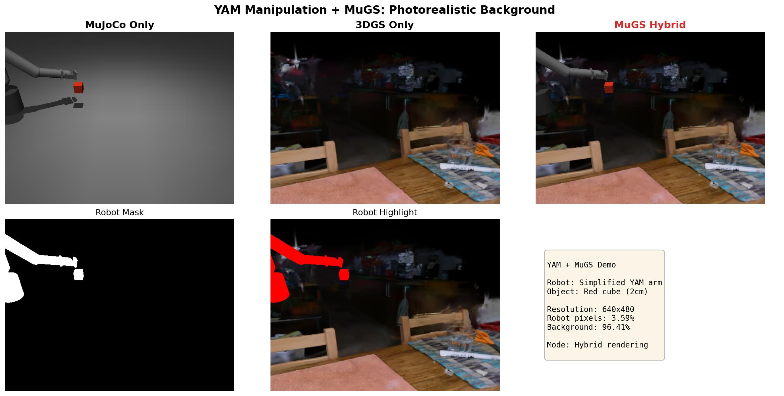

# MuGS: MuJoCo + 3D Gaussian Splatting for Photorealistic Robot Simulation

Hybrid rendering pipeline combining MuJoCo physics simulation with 3D Gaussian Splatting photorealistic backgrounds.



### AndroidTwin × MuGS — G1 humanoid in INRIA kitchen


Unitree G1 (53 dof, Inspire FTP hands) on the `p1_amo_table_grasp`
bench composited on the INRIA *kitchen* 3DGS scene; bg cam tracks
MuJoCo head_cam delta from an initial-aligned pose. See
[`showcase/androidtwin_g1/`](showcase/androidtwin_g1/README.md) for
the full write-up + animation.

## Features

- **Hybrid Rendering**: 3DGS background + MuJoCo foreground @ 5000 FPS
- **Physics-Accurate**: Full MuJoCo physics simulation
- **Photorealistic**: 3D Gaussian Splatting for realistic backgrounds
- **Camera Aligned**: Automatic camera parameter extraction and coordinate system conversion
- **Easy Integration**: Drop-in sensor for mjlab/IsaacLab environments

## Quick Start

```python
from mugs.sensors import GaussianSensor, GaussianSensorConfig

# Configure sensor
config = GaussianSensorConfig(
    width=640,
    height=480,
    background_ply_path="path/to/point_cloud.ply",
    render_mode="hybrid",
    robot_geom_names=["link1", "link2", "gripper"],
)

sensor = GaussianSensor(config)

# Render
result = sensor.render(model, data, camera_name, return_components=True)

# Access components
rgb = result['rgb']              # Final hybrid image
foreground = result['foreground'] # MuJoCo only
background = result['background'] # 3DGS only
mask = result['mask']            # Blending mask
```

## Demos

### YAM Manipulation
```bash
TORCH_CUDA_ARCH_LIST="8.6" python examples/yam_standalone_demo.py
```

### Quality Comparison
```bash
TORCH_CUDA_ARCH_LIST="8.6" python examples/quality_comparison_demo.py
```

### Wrist Camera (Task View)
```bash
TORCH_CUDA_ARCH_LIST="8.6" python examples/yam_wrist_camera_demo.py
```

### Using External Assets
```bash
# List available external asset sources
python scripts/download_external_assets.py list

# Download GS-Playground assets
python scripts/download_external_assets.py gs-playground

# Download Bridge-GS dataset
python scripts/download_external_assets.py bridge-gs

# Run examples with external assets
TORCH_CUDA_ARCH_LIST="8.6" python examples/use_external_assets.py
```

See `docs/EXTERNAL_ASSETS.md` for detailed tutorial.

## Performance

- **Resolution**: 640×480
- **FPS**: ~5000 (hybrid mode)
- **Background Loading**: ~2s (cached for subsequent renders)

## Technical Details

### Camera Alignment

MuGS automatically handles camera parameter extraction and coordinate system conversion:

1. **FOV Handling**: Respects MuJoCo's `<compiler angle="radian"/>` directive
2. **Coordinate System**: Converts MuJoCo (+Z forward) to OpenGL (-Z forward)
3. **View Matrix**: Automatic construction from camera position and rotation

See `docs/CAMERA_ALIGNMENT_FIX.md` for details.

### Rendering Pipeline

1. Extract camera parameters from MuJoCo
2. Render MuJoCo foreground (robot + objects)
3. Render 3DGS background with aligned camera
4. Alpha-composite using robot segmentation mask

## Documentation

- `docs/DESIGN.md` - System architecture and design decisions
- `docs/CAMERA_ALIGNMENT_FIX.md` - Camera parameter handling
- `docs/SHOWCASE.md` - Creating demonstration materials
- `docs/TODO.md` - Development roadmap

## Requirements

- Python 3.8+
- MuJoCo 3.0+
- PyTorch 2.0+
- gsplat
- CUDA toolkit (for RTX 4090: use CUDA 12.0+, or set `TORCH_CUDA_ARCH_LIST="8.6"`)

## Citation

```bibtex
@article{mugs2026,
  title={MuGS: Photorealistic Simulation for Vision-Language-Action Models},
  author={},
  journal={},
  year={2026}
}
```

## License

MIT License

## Acknowledgments

- MuJoCo physics engine
- gsplat rendering library
- Kitchen scene from 3DGS benchmark
