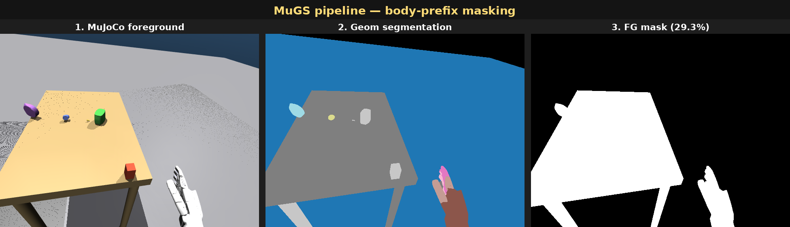
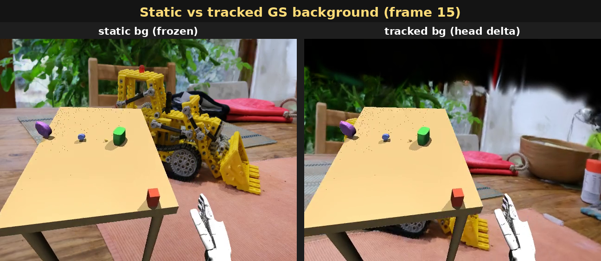
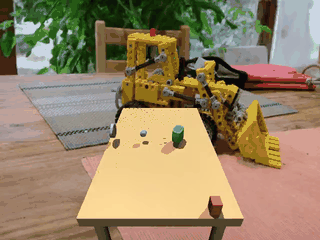

# MuGS: MuJoCo + 3D Gaussian Splatting for Photorealistic Robot Simulation

**MuGS** is a hybrid rendering pipeline that combines MuJoCo physics simulation with 3D Gaussian Splatting (3DGS) photorealistic backgrounds to create photo-realistic robot simulation environments for Vision-Language-Action (VLA) model training and evaluation.

## What is MuGS?

MuGS enables **photorealistic robot simulation** by compositing physically accurate MuJoCo robot renders with real-world 3DGS backgrounds at **5000+ FPS**. It bridges the Sim2Real gap for vision-based robot learning by providing training data that looks like real photos while maintaining perfect physics simulation.

**Key Innovation**: Two-stage rendering pipeline
- **Stage 1**: MuJoCo renders robot/objects (CPU-based, fast)
- **Stage 2**: 3DGS renders background (GPU-based, photorealistic)
- **Compositing**: Alpha-blending with automatic segmentation masks


### AndroidTwin × MuGS — G1 humanoid in INRIA kitchen

Hybrid render demo from the **AndroidTwin** humanoid bench
(Unitree G1 + Inspire FTP 5-finger hands, 53 dof) composited on the
INRIA mip-NeRF 360 *kitchen* 3DGS scene.
Task: `p1_amo_table_grasp` (4 GraspNet objects on a table, AMO
whole-body controller, head_cam first-person view), zero-policy
30-step rollout.

#### Pipeline — body-prefix masking



`scene_inspire.xml` leaves geoms unnamed, so the recorder resolves
foreground pixels by **body name prefix** instead of geom name.
SceneCfg attaches each entity with a namespace prefix (`robot/`,
`table/`, `obj_NNN/`, `grasp_cube/`…); any geom whose parent body
matches one of the configured prefixes joins the fg mask.

| panel | what |
|-------|------|
| 1. MuJoCo foreground | `mujoco.Renderer.render()` at `robot/head_cam` |
| 2. Geom segmentation | `enable_segmentation_rendering()` raw geom-id channel |
| 3. FG mask | `np.isin(seg, fg_geom_ids)` → 29.3% coverage on this view |

#### Hybrid render — bg cam tracks MuJoCo head


3DGS scenes live in COLMAP world frames disjoint from MuJoCo world.
The recorder pins the **initial** GS bg pose to a training cam
(kitchen `cam[0]`) and *assumes* it coincides with the initial MuJoCo
head_cam pose; on each capture it applies the MuJoCo-frame head_cam
delta (rotated into GS frame) on top of that initial pose so the bg
tracks head motion. Intrinsics stay fixed at the kitchen training
cam's fx/fy.

```
R_align = R_gs0 · R_mj0ᵀ           # one-shot at first capture
pos_t   = pos_gs0 + R_align · (pos_mj_t − pos_mj_0)
R_t     = R_align · R_mj_t
```

#### Static vs tracked background



Same MuJoCo frame, two bg policies:

- **Left (static)** — `bg_t == bg_0` for every capture; bg-region
  pixel diff stays at 0.05/255 (just libx264 noise).
- **Right (tracked)** — bg follows head motion; bg-region pixel
  diff rises to ~90/255 by frame 5 (kitchen content shifts as expected).

#### Animation



16-frame loop @ 10 fps, 320×240 (downsampled from 31-frame mp4 at
640×480). Top of frame turns black mid-rollout because the head
pitches down enough that the bg cam looks above the kitchen ply's
trained volume — a known tradeoff of the no-scale-calibration
assumption.

#### Reproduce

```bash
uv run at-eval \
  --task p1_amo_table_grasp --policy zero \
  --num-episodes 1 --max-episode-steps 30 \
  --camera robot/head_cam \
  --render-backend mugs --mugs-mode hybrid \
  --mugs-ply  /path/to/kitchen/point_cloud.ply \
  --mugs-bg-cam-json /path/to/kitchen/cameras.json \
  --mugs-bg-cam-idx 0 \
  --eval-dir outputs/evals_mugs_hybrid
```

`MUJOCO_GL=egl` required on headless servers. The wrapper
(`MuGSRecorder`) lives at `androidtwin/envs/mugs_recorder.py` in the
AndroidTwin repo and uses MuGS's standalone `GaussianSensor` API.

## Features

### Core Rendering
- **Hybrid Rendering**: 3DGS background + MuJoCo foreground @ 5000+ FPS
- **Physics-Accurate**: Full MuJoCo physics simulation with contact dynamics
- **Photorealistic**: 3D Gaussian Splatting for realistic backgrounds from real-world scans
- **Camera Aligned**: Automatic camera parameter extraction and coordinate system conversion
- **Flexible Modes**: `hybrid`, `3dgs_only`, `mujoco_only` rendering modes

### Integration & Usability
- **Easy Integration**: Drop-in `GaussianSensor` API for standalone use
- **Batch Rendering**: mjlab integration for parallel multi-environment rendering
- **Automatic Masking**: Body-prefix or geom-name based foreground segmentation
- **Camera Tracking**: Dynamic background camera follows MuJoCo camera motion

### Post-Processing (Optional)
- **Super-Resolution**: AI upscaling (Real-ESRGAN) for photorealistic detail
  - Low-res rendering (320×240) → High-res output (1280×960)
  - 4x upscaling with photorealistic texture enhancement
  - Modular design: lazy-loaded, GPU-accelerated, batch processing support

### Asset Support
- **Pretrained Scenes**: INRIA kitchen (mip-NeRF 360 dataset)
- **External Assets**: GS-Playground scenes, DISCOVERSE tasks (via download scripts)
- **Custom Scenes**: Support for any 3DGS PLY files from COLMAP/Nerfstudio

## Quick Start

### Basic Rendering

```python
from mugs.sensors import GaussianSensor, GaussianSensorConfig

# 1. Configure sensor
config = GaussianSensorConfig(
    width=640,
    height=480,
    background_ply_path="path/to/point_cloud.ply",
    render_mode="hybrid",  # "hybrid" | "3dgs_only" | "mujoco_only"
    robot_geom_names=["link1", "link2", "gripper"],
)

sensor = GaussianSensor(config)

# 2. Render
result = sensor.render(model, data, camera_name, return_components=True)

# 3. Access components
rgb = result['rgb']              # Final hybrid image (H, W, 3) uint8
foreground = result['foreground'] # MuJoCo only
background = result['background'] # 3DGS only
mask = result['mask']            # Blending mask
```

### With Super-Resolution (Optional)

```python
from mugs.postprocess import SuperResolution, SuperResolutionConfig

# 1. Low-res rendering (fast)
sensor = GaussianSensor(GaussianSensorConfig(width=320, height=240, ...))
img_lr = sensor.render(model, data, camera_name)  # 320×240

# 2. AI upscaling (photorealistic)
sr = SuperResolution(SuperResolutionConfig(
    model_name="RealESRGAN_x4plus",
    scale=4,
))
img_hr = sr.upscale(img_lr)  # 1280×960

# Installation: pip install realesrgan basicsr
# Download model: python scripts/download_sr_models.py --model RealESRGAN_x4plus
```

## Demos

### YAM Manipulation
```bash
TORCH_CUDA_ARCH_LIST="8.6" python examples/yam_standalone_demo.py
```

### Quality Comparison
```bash
TORCH_CUDA_ARCH_LIST="8.6" python examples/quality_comparison_demo.py
```

### Wrist Camera (Task View)
```bash
TORCH_CUDA_ARCH_LIST="8.6" python examples/yam_wrist_camera_demo.py
```

### Super-Resolution Pipeline
```bash
# 1. Install SR dependencies
pip install realesrgan basicsr

# 2. Download pretrained models
python scripts/download_sr_models.py --model RealESRGAN_x4plus

# 3. Run demo
TORCH_CUDA_ARCH_LIST="8.6" python examples/sr_pipeline_demo.py
```

### Using External Assets
```bash
# List available external asset sources
python scripts/download_external_assets.py list

# Download GS-Playground assets
python scripts/download_external_assets.py gs-playground

# Download Bridge-GS dataset
python scripts/download_external_assets.py bridge-gs

# Run examples with external assets
TORCH_CUDA_ARCH_LIST="8.6" python examples/use_external_assets.py
```

See `docs/EXTERNAL_ASSETS.md` for detailed tutorial.

## Performance

- **Resolution**: 640×480
- **FPS**: ~5000 (hybrid mode)
- **Background Loading**: ~2s (cached for subsequent renders)

## Technical Details

### Camera Alignment

MuGS automatically handles camera parameter extraction and coordinate system conversion:

1. **FOV Handling**: Respects MuJoCo's `<compiler angle="radian"/>` directive
2. **Coordinate System**: Converts MuJoCo (+Z forward) to OpenGL (-Z forward)
3. **View Matrix**: Automatic construction from camera position and rotation

See `docs/CAMERA_ALIGNMENT_FIX.md` for details.

### Rendering Pipeline

1. Extract camera parameters from MuJoCo
2. Render MuJoCo foreground (robot + objects)
3. Render 3DGS background with aligned camera
4. Alpha-composite using robot segmentation mask

## Documentation

### Getting Started
- **[`docs/OVERVIEW.md`](docs/OVERVIEW.md)** - 📘 Project overview (what MuGS does, repo structure, use cases)
- **[`docs/API_QUICKSTART.md`](docs/API_QUICKSTART.md)** - 🚀 Quick start guide (中文)
- **[`docs/API_REFERENCE.md`](docs/API_REFERENCE.md)** - 📖 Complete API reference

### Technical Guides
- **[`docs/SUPER_RESOLUTION.md`](docs/SUPER_RESOLUTION.md)** - 🎨 AI upscaling guide (Real-ESRGAN)
- **[`docs/CAMERA_ALIGNMENT_FIX.md`](docs/CAMERA_ALIGNMENT_FIX.md)** - 📐 Camera parameter handling
- **[`docs/EXTERNAL_ASSETS.md`](docs/EXTERNAL_ASSETS.md)** - 📦 Using GS-Playground, DISCOVERSE assets
- **[`docs/SHOWCASE.md`](docs/SHOWCASE.md)** - 🎬 Creating demonstration materials

### Design & Status
- **[`docs/design/DESIGN.md`](docs/design/DESIGN.md)** - 🏗️ System architecture (12k words)
- **[`docs/PROJECT_STATUS.md`](docs/PROJECT_STATUS.md)** - 📊 Current status
- **[`TODO.md`](TODO.md)** - 📋 Development roadmap

## Requirements

- Python 3.8+
- MuJoCo 3.0+
- PyTorch 2.0+
- gsplat
- CUDA toolkit (for RTX 4090: use CUDA 12.0+, or set `TORCH_CUDA_ARCH_LIST="8.6"`)

## Citation

```bibtex
@article{mugs2026,
  title={MuGS: Photorealistic Simulation for Vision-Language-Action Models},
  author={},
  journal={},
  year={2026}
}
```

## License

MIT License

## Acknowledgments

- MuJoCo physics engine
- gsplat rendering library
- Kitchen scene from 3DGS benchmark
