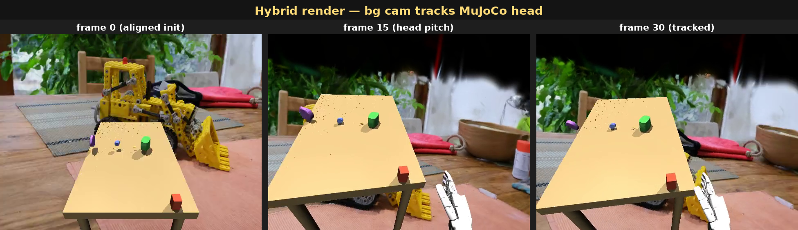

# AndroidTwin × MuGS — G1 humanoid + INRIA kitchen

Hybrid render demo from the **AndroidTwin** humanoid bench
(Unitree G1 + Inspire FTP 5-finger hands, 53 dof) composited on the
INRIA mip-NeRF 360 *kitchen* 3DGS scene.

Task: `p1_amo_table_grasp` (4 GraspNet objects on a table, AMO whole-body
controller, head_cam first-person view), zero-policy 30-step rollout.

---

## 1. Pipeline — body-prefix masking


`scene_inspire.xml` leaves geoms unnamed, so the recorder resolves
foreground pixels by **body name prefix** instead of geom name. SceneCfg
attaches each entity with a namespace prefix (`robot/`, `table/`,
`obj_NNN/`, `grasp_cube/`…); any geom whose parent body matches one of
the configured prefixes joins the fg mask.

| panel | what |
|-------|------|
| 1. MuJoCo foreground | `mujoco.Renderer.render()` at `robot/head_cam` |
| 2. Geom segmentation | `enable_segmentation_rendering()` raw geom-id channel |
| 3. FG mask | `np.isin(seg, fg_geom_ids)` → 29.3% coverage on this view |

## 2. Hybrid render — bg cam tracks MuJoCo head



3DGS scenes live in COLMAP world frames disjoint from MuJoCo world. The
recorder pins the **initial** GS bg pose to a training cam (kitchen
`cam[0]`) and *assumes* it coincides with the initial MuJoCo head_cam
pose; on each capture it applies the MuJoCo-frame head_cam delta
(rotated into GS frame) on top of that initial pose so the bg tracks
head motion. Intrinsics stay fixed at the kitchen training cam's fx/fy.

```
R_align = R_gs0 · R_mj0ᵀ           # one-shot at first capture
pos_t   = pos_gs0 + R_align · (pos_mj_t − pos_mj_0)
R_t     = R_align · R_mj_t
```

## 3. Static vs tracked background


Same MuJoCo frame, two bg policies:

- **Left (static)** — `bg_t == bg_0` for every capture; bg-region
  pixel diff stays at 0.05/255 (just libx264 noise).
- **Right (tracked)** — bg follows head motion; bg-region pixel diff
  rises to ~90/255 by frame 5 (kitchen content shifts as expected).

## 4. Animation


16-frame loop @ 10 fps, 320×240 (downsampled from 31-frame mp4 at
640×480). Top of frame turns black mid-rollout because the head pitches
down enough that the bg cam looks above the kitchen ply's trained
volume — a known tradeoff of the no-scale-calibration assumption.

---

## How to reproduce

From the [AndroidTwin](https://github.com/) repo:

```bash
uv run at-eval \
  --task p1_amo_table_grasp --policy zero \
  --num-episodes 1 --max-episode-steps 30 \
  --camera robot/head_cam \
  --render-backend mugs --mugs-mode hybrid \
  --mugs-ply  /path/to/kitchen/point_cloud.ply \
  --mugs-bg-cam-json /path/to/kitchen/cameras.json \
  --mugs-bg-cam-idx 0 \
  --eval-dir outputs/evals_mugs_hybrid
```

`MUJOCO_GL=egl` required on headless servers.

The wrapper (`MuGSRecorder`) lives at
`androidtwin/envs/mugs_recorder.py` and uses MuGS's
`GaussianSensor` standalone API.
